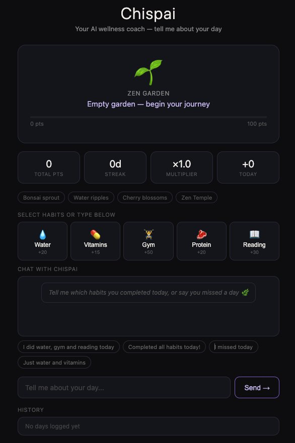
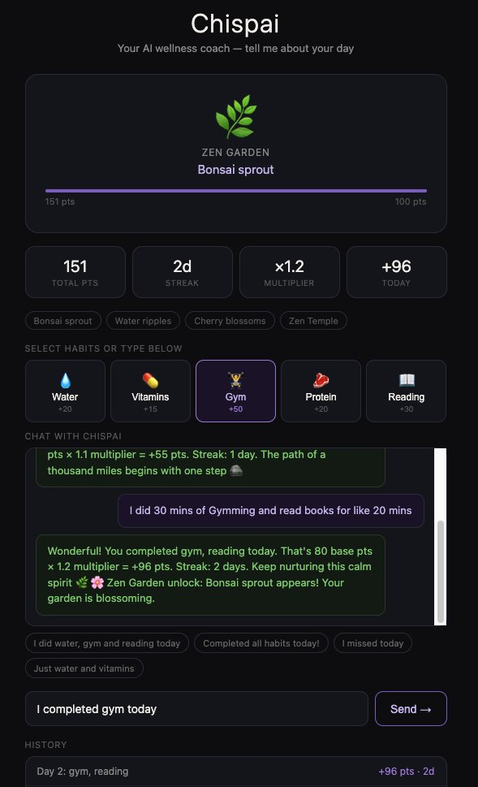

# Chispai — AI Wellness Agent

> Your spark. Your guide. Your best self.

An AI-powered wellness agent that helps users manage anxiety, build daily habits, and find balance through gamification and zen-inspired design. Bilingual: English & Spanish.

The name blends **"Chispa"** (Guatemalan for inner spark) and **"Pai"** (Japanese for master/guide). Together: *the master of your inner spark.*

---

## Demo

[](https://www.youtube.com/watch?v=PDXuixaqCmo)

▶️ [Watch the full demo on YouTube](https://www.youtube.com/watch?v=PDXuixaqCmo)

---

## Screenshots

### Starting State


### In Action — Natural Language + Azure Response


---

## The Problem

Most people start the week motivated to drink more water, exercise, sleep better and manage anxiety… but by Wednesday they feel overwhelmed, guilty and out of control.

Existing wellness apps add pressure with rigid streaks and notifications that increase anxiety instead of reducing it.

---

## The Solution

Chispai is a compassionate AI wellness agent that meets you where you are. It turns messy human weeks into realistic, gentle plans and helps you recover with kindness on hard days.

---

## Key Features

- **Sunday Voice/Text Planning** — Speak naturally and Chispai organizes your entire week
- **Smart Daily Itinerary** — Combines your real schedule with one meaningful wellness mission
- **Gentle Resets** — 2-minute breathing sessions with calming zen messages when you feel overwhelmed
- **Health & Habit Tracker** — Water, vitamins, gym, reading, protein — all in one place
- **Zen Garden Gamification** — A beautiful bonsai that grows with your real progress (no punishment for imperfect days)
- **Bilingual Experience** — Fully available in English and Spanish

---

## How It Works (Agent Flow)

1. **Sunday Brain Dump** → User speaks or writes freely
2. **AI Reasoning** → Chispai understands priorities, schedule and emotional state
3. **Personalized Plan** → Creates realistic weekly structure
4. **Daily Support** → Gentle reminders + mindful resets
5. **Progress & Rewards** → Gamified Zen Garden that reflects real growth

---

## Microsoft IQ Integration

Chispai integrates **Work IQ** to provide context-aware planning:
- Reads user's Microsoft 365 calendar, emails and meetings
- Understands work context and suggests optimal wellness slots
- Creates grounded, personalized recommendations based on real user data

This allows the agent to reason intelligently about the user's actual life instead of generic advice.

---

## Gamification Rules (Aravind's Layer)

| Habit    | Points |
|----------|--------|
| Water    | 20     |
| Vitamins | 15     |
| Gym      | 50     |
| Protein  | 20     |
| Reading  | 30     |

- **Streak multiplier**: ×1.1 per day, capped at ×2.0
- **Combo bonus**: +25 pts when 3+ habits completed in one day
- **Wabi-Sabi grace**: 1 miss = streak preserved. 2 consecutive misses = streak reset.
- **Zen Garden unlocks**: 100 / 250 / 500 / 1000 pts

---

## Architecture

```
User types in UI
      ↓
Habit extraction (NLP)
      ↓
Azure Function /api/log
      ↓
Gamification engine (points, streaks, combos)
      ↓
Zen Garden updates + zen response
```

---

## Live Endpoints

```
POST https://chispai-gamification.azurewebsites.net/api/log
POST https://chispai-gamification.azurewebsites.net/api/summary
```

### POST /api/log — Example

**Request:**
```json
{
  "state": null,
  "completed_habits": ["water", "gym", "reading"],
  "today": "2026-06-14"
}
```

**Response:**
```json
{
  "result": {
    "date": "2026-06-14",
    "habits_completed": ["water", "gym", "reading"],
    "base_points": 100,
    "combo_bonus": 25,
    "multiplier": 1.1,
    "total_earned": 137.5,
    "streak_days": 1,
    "new_unlocks": ["Bonsai sprout appears"],
    "wabi_sabi_grace": false,
    "streak_reset": false
  },
  "state": {
    "total_points": 137.5,
    "streak_days": 1,
    "current_multiplier": 1.1,
    "garden_stage": "Bonsai sprout appears",
    "unlocked_rewards": ["Bonsai sprout appears"]
  }
}
```

---

## Project Structure

```
chispai/
├── gamification_engine/
│   ├── function_app.py      ← Azure Function HTTP triggers
│   ├── engine.py            ← Core gamification logic
│   ├── host.json            ← Azure Function config
│   └── requirements.txt
├── ui/
│   └── chispai_final.html   ← Demo UI (chat + live Azure calls)
├── screenshots/
│   ├── screenshot1.png
│   └── screenshot2.png
└── README.md
```

---

## Deploy to Azure

```bash
az login
az group create --name chispai-rg --location eastus
az storage account create --name chispaistorage --location eastus --resource-group chispai-rg --sku Standard_LRS
az functionapp create --resource-group chispai-rg --consumption-plan-location eastus --runtime python --runtime-version 3.11 --functions-version 4 --name chispai-gamification --storage-account chispaistorage --os-type linux
cd gamification_engine
func azure functionapp publish chispai-gamification --python
```

---

## Built With

- **Microsoft Azure AI** & **Azure Functions**
- **Copilot Studio** (Agent orchestration)
- **Power Automate**
- **Work IQ** (Intelligence layer)
- **Azure AI Foundry** (Agent + OpenAPI tool integration)
- **Python 3.11**

---

## Team

- **Melissa Pereira** — Founder, Product & Vision (Guatemala)
- **Aravind Sathyanarayanan** — Dveloper, Gamification & Azure Backend

---

*Microsoft Agents League Hackathon 2026*
